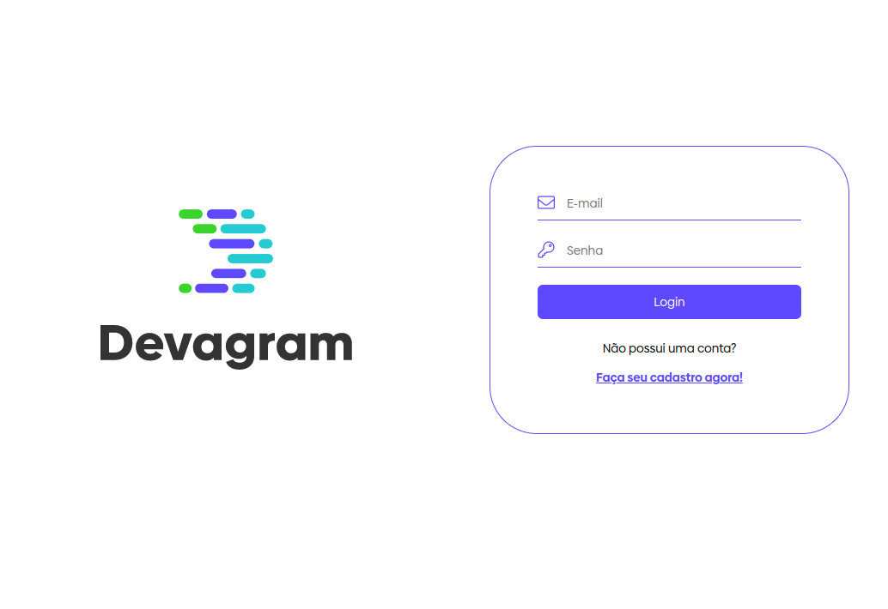

<h1 align="center">  Devagram  </h1>

<h4 align="center"> 
	  Status: Concluido 🚀 
</h4>

<br />

<p align="center">Nesse projeto foi criado um clone do instagram para Devs Angular. Nele você poderá criar suas postagens, fazer comentarios, dar likes e seguir seus amigos.
</p>

<br />

<p align="center"></p>

<br />

<br />

<p align="center">Link Vercel: https://devagram-angular-mfva9eef7-daygorgonha.vercel.app/login</p>

<br />

##  Tecnologias

As seguintes ferramentas foram usadas na construção do projeto:

<p align="center">
  
  
  
  

</p>

<br />

### Instalação e Execução do Projeto

- Clone este repositório

```
> git clone https://github.com/daygorgonha/devagram-angular.git
```

- Navegue até o diretório principal do projeto

```
> devagram-angular
```

- Execute o projeto

```
> ng serve --open
```

<br/>

---

<div align="center">
  <br />
  <a href="https://github.com/daygorgonha">
    
    <br />
    <small>Feito com ❤️ by <a href="https://www.linkedin.com/in/dayanegorgonha/">Dayane Gorgonha</a></small>
  </a>
